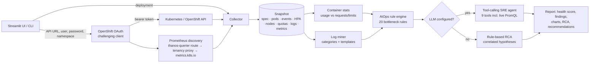

# OCP Bottleneck Analyzer

**AIOps + Agentic Ops for OpenShift.** Enter a cluster API URL, credentials and a namespace, pick a
deployment, and the analyzer reads everything around it: workload spec, ReplicaSets, pods, events, HPA,
hosting nodes, ResourceQuotas, container logs (including crashed instances) and Prometheus/Thanos metrics.
A deterministic rule engine detects bottlenecks, and a tool-calling LLM agent investigates them and writes a
root-cause summary with remediation steps.

> Read-only by design: it only issues `GET` requests against the API server and Prometheus.

## Architecture



| Module | Responsibility |
| --- | --- |
| `client.py` | OAuth login (`oc login -u -p` flow), read-only REST client |
| `prometheus.py` | Thanos/Prometheus queries and endpoint discovery (cluster-wide route or namespace-scoped tenancy) |
| `queries.py` | PromQL: CPU usage and CFS throttling, memory working set and 1h peak, restarts, network, drops, p95 latency, node utilisation |
| `collector.py` | Best-effort collection into a `Snapshot`; RBAC gaps become warnings, not failures |
| `logs.py` | Log classification (OOM, DB pool, timeouts, DNS, TLS, 5xx, GC, ...) and template clustering |
| `rules.py` | Rule engine producing ranked `Finding`s and a health score |
| `agent.py` | OpenAI-compatible tool-calling agent (OpenAI, Azure OpenAI, Ollama, vLLM, LiteLLM) |
| `report.py` | Rule-based root-cause hypotheses, Markdown export |
| `demo.py` | Synthetic cluster + Prometheus for demos and tests |

## What it detects

| Category | Rules |
| --- | --- |
| Memory | OOMKilled containers, working set close to limit, OOM / GC log signatures |
| CPU | CFS throttling, usage at limit, usage far above request, uneven load across replicas |
| Availability | Unavailable replicas, stuck rollouts, CrashLoopBackOff/restarts, image/config errors, readiness/liveness probe failures |
| Capacity | HPA pinned at `maxReplicas` above target, Pending pods (`FailedScheduling`), ResourceQuota exhaustion, single replica, over-provisioned requests (cost) |
| Node | NotReady, Memory/Disk/PID pressure, hot nodes |
| Dependencies | DB pool exhaustion, timeouts, connection refused, DNS, TLS errors in logs |
| Latency / network | High p95 HTTP latency (common histogram names), packet drops |

## Quick start

```bash
cd projects/ocp-bottleneck-analyzer
python -m venv .venv && source .venv/bin/activate
pip install -e ".[ui]"

# UI (toggle "Demo mode" in the sidebar to try it without a cluster)
streamlit run app/streamlit_app.py

# CLI
ocp-analyzer deployments --demo
ocp-analyzer analyze --demo -d checkout-service -o report.md

# Live cluster
export OCP_PASSWORD='...'
ocp-analyzer deployments --api-url https://api.mycluster.example.com:6443 -u developer -n shop
ocp-analyzer analyze --api-url https://api.mycluster.example.com:6443 -u developer -n shop \
  -d checkout-service -o report.md --json report.json
```

`--token "$(oc whoami -t)"` can be used instead of username/password (handy for SSO-only clusters).
`--insecure` disables TLS verification for lab clusters that use self-signed certificates.

### Enabling the LLM agent

Without an LLM the analyzer still produces a full rule-based report. To enable the agent, set:

| Provider | Environment |
| --- | --- |
| OpenAI | `OPENAI_API_KEY`, optional `LLM_MODEL` (default `gpt-4o-mini`) |
| OpenAI-compatible (Ollama, vLLM, LiteLLM) | `OPENAI_BASE_URL=http://host:11434/v1`, `LLM_MODEL=llama3.1` |
| Azure OpenAI | `LLM_PROVIDER=azure`, `AZURE_OPENAI_ENDPOINT`, `AZURE_OPENAI_API_KEY`, `LLM_MODEL=<deployment>` |

These can also be entered in the UI sidebar. The agent gets these tools: `get_rule_findings`,
`get_deployment_overview`, `get_container_stats`, `get_events`, `get_node_status`, `get_log_insights`,
`get_logs` (with regex grep), `get_metrics_summary` and `run_promql`. Its tool-call trace is shown in the
UI. If the LLM call fails, the analyzer falls back to the rule-based summary.

## Permissions

| Access | Needed for | Without it |
| --- | --- | --- |
| `view` on the namespace | deployments, pods, logs, events, HPA, quotas | required |
| `get nodes` | node conditions | node checks skipped |
| `cluster-monitoring-view` | Thanos route (all metrics incl. node utilisation) | namespace-scoped tenancy endpoint, then `metrics.k8s.io` |

See [`deploy/openshift/rbac-readonly.yaml`](deploy/openshift/rbac-readonly.yaml).

## Deploy on OpenShift

```bash
podman build -t quay.io/YOUR_ORG/ocp-bottleneck-analyzer:latest . && podman push quay.io/YOUR_ORG/ocp-bottleneck-analyzer:latest
oc new-project bottleneck-analyzer
cp deploy/openshift/llm-secret.example.yaml llm-secret.yaml   # optional, fill in and keep out of git
oc apply -f llm-secret.yaml
oc create secret generic ocp-bottleneck-analyzer-proxy --from-literal=session_secret="$(openssl rand -hex 16)"
oc apply -k deploy/openshift
oc get route ocp-bottleneck-analyzer
```

The Route is protected by an OpenShift `oauth-proxy` sidecar: users sign in with their cluster account and must be
allowed to `get` the `ocp-bottleneck-analyzer` Service in that namespace. Streamlit only listens on `127.0.0.1`.

The image is based on UBI 9 Python 3.11 and runs as a non-root user (OpenShift `restricted-v2` SCC compatible).

## Demo scenarios

| Deployment | Story |
| --- | --- |
| `checkout-service` | CPU-throttled pods, HPA pinned at max, one pod OOMKilled, one Pending for lack of CPU, DB pool exhaustion and slow payment calls in the logs, hot node, CPU quota nearly used up |
| `payment-gateway` | CrashLoopBackOff caused by a DNS failure for its database Service; liveness probe failures |
| `catalog-service` | Healthy but over-provisioned (FinOps finding); shares a node that is under memory pressure |

## Development

```bash
pip install -e ".[dev]"
ruff check . && ruff format --check .
pytest -q
```

Tests cover the OAuth flow and REST client (mocked with `responses`), Prometheus discovery, log mining,
every demo scenario end-to-end, the agent tool loop (scripted fake LLM) and the CLI.

## Roadmap

- Multi-deployment / namespace-wide scans and dependency graph from Service → Route → pods
- Anomaly detection on metric time series (seasonal baselines) in addition to static thresholds
- Remediation PRs (patched resources/HPA YAML) generated by the agent, with human approval
- Export findings to Alertmanager / Slack
